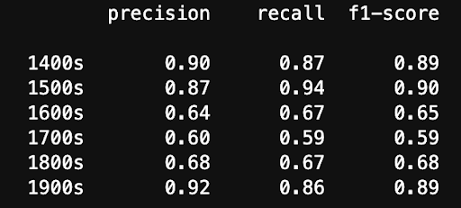

# english-identity-model
A model that can identify the date in which text was written based on the style of the text.

## Problem Statement
Language is dynamic, evolving over time with shifts in vocabulary, syntax, and style. These changes are influenced by cultural, social, and historical factors, making the study of linguistic evolution an intriguing area for research. Understanding when a piece of text was likely written can provide valuable insights into literary trends, historical contexts, and cultural analysis.  Our project aims to develop a machine learning model capable of estimating the date range of an English text based solely on its linguistic features. By analyzing stylistic and linguistic patterns, such as vocabulary trends, orthography, morphosyntax, and phrase frequencies, our model will learn to associate textual characteristics with specific historical periods, ultimately aiming to classify a given text/excerpt with a date range. 

## Background Research
The bulk of research in this area seems to have been done relatively early in the field of machine learning, with most papers being released in the mid-2000s, before the modernities of BERT and such. Most also dealed in the limited time-scales of newspapers. Regardless, these were a good starting off point. 
- Temporal Language Models for the Disclosure of Historical Text - https://repository.ubn.ru.nl/bitstream/handle/2066/228230/228230.pdf
    - Good intro paper showing related research and two classification methods, one being comparing the text of an undated document with how far the language has diverged from a model dated document, and the other comparing word frequencies across time periods. 
- Diachronic Text Evaluation - https://aclanthology.org/S15-2147/
    - Used a multitude of really interesting methods, such as finding named entities in the text and linking them to Wikipedia to get a time estimate, and also comparing syntactic nodes with Google's n-gram database

## Data
Data sourced from the free ebook source [Project Gutenburg](https://www.gutenberg.org/)
- Link to download zip and metadata for texts found [here.](https://www.gutenberg.org/cache/epub/feeds/)
    - Texts: txt-files.tar.zip
    - Metadata: pg_catalog.csv
- Retrieved all available texts: 75,627
- Data exploration and cleaning in `data_exploration.ipynb` and `data_cleaning.ipynb` respectively.
- Final dataset: `uniform_excerpts_2.csv`
    - `text`, `text_number` and `label` columns representing the excerpt from the text, corresponding text ID number, and era labels respectively.
    - Includes texts ranging from 1400s to 1900s
    - Random sampled old texts to achieve a uniform distribution of 6,000 total entries, 1,000 entries per era.
    - Filter out intros and outros from modern day.
    - Excerpts standardized to 400-600 characters long
    - Remove text with apparent OCR issues if there were too many unrecognizable characters.
    - Filter out any text with multiple authors, a translator, and original language not in English.
- Final dataset example entries given below:

## Models

### Naive-Bayes
This model was built using nltk's naive bayes classifier. In this model we manually added features we deemed likely to be important to the model. We had a training, validation, and test split. We would train our model on the training data, and test its performance on the unseen validation data. We did a loop of tweaking the features and testing the validaion accuracy to find the set of features that caused the model to perform its best. We then tested the final model on the testing dataset. We created lists of words that were only found in certain eras of english texts and used those as features in the model. This bag of words approach did really well and got to about a .45 accuracy, well above our baseline of .17. We also tried a bigram model. The bigram model did exceptionally well and had about a .7 accuracy. The naive bayes was especially helpful because its a white box like model, and showed us what features are important for the next steps of our project. We saw the model did really well at classifying texts from the 1400s, 1500s, and 1900s, and was most confused between the 16,17, and 1800s texts. This is likely because vocabulary didn't change that much during those eras. It was also helpful because it ran way faster than even the DistilBERT model. Training the bigram and testing it took less than 30 seconds on our personal machines, and even faster without using bigram features. Some other features we tried to use were sentence length and word length, however these features turned out not to be helpful at all. The code/results can be reproduced by simply running all the cells in the naive_bayes_model.ipynb jupyter notebook. The notebook depends on the nltk, seaborn, matplotlib, pandas, collections and numpy libraries. The data used to train the model is located in the data folder, the relative path should already be correct in the notebook. The data was preprocessed from the project gutenberg dataset, and the final processed version of our dataset is the "uniform_excerpts_2.csv". That csv file should be ready to use and is the fully cleaned version of the dataset that we used for the project. The team member in charge of this section of the codebase was Zach Conroy.

### BERT
BERT has wrestled with us these past few weeks, refusing to run on CURC, and being finnicky in local environments. As of writing, it is still training, but shows high validation loss, and a very long training time, around an hour on a Macbook Air m1. DistiliBERT runs superior to in as of now, especially with our limited hardware
### DistilBERT
**Description**
This model is built on the lightweight and efficient DistilBERT transformer architecture, the model leverages contextual embeddings to learn stylistic and lexical patterns across time. DistilBERT is smaller and faster than BERT, which was pretrained on the same corpus in a self-supervised fashion, using the BERT base model as a teacher. We opted to use the uncased version of the model, in which upper and lower case is treated equally. The reason we used DistilBERT due to its speed and performance retentions. DistilBERT is 60% faster than BERT retains 97% of BERT performance, which was important as one training iteration using a CURC job took ~1 hour.

**Methods**
We fine-tuned the distilbert-base-uncased model on out dataset of ~6,000 excerpts. Texts were tokenized using DistilBertTokenizerFast with padding/truncation to a max length of 256 tokens. The model was trained using an 80/10/10 train/val/test split with a learning rate of 1e-4, weight decay of 0.05, and trained for 6 epochs using cross-entropy loss. The below training an validation loss is plotted, showing overfitting on our training data. Despite attempts to lower learning rate and increase weight-decay, we still saw this overfitting with suffered performance. 

**Results**
The DistilBERT model achieved a test accuracy of 0.79, outperforming baseline and Naive Bayes approaches. 

It performed especially well in classifying excerpts from the 1400s–1500s and the 1900s. However, it showed weaker performance distinguishing between the 1600s, 1700s, and 1800s—likely due to the same reasons discussed during Naive Bayes.

Overall, we were pleased with the results from DistilBERT, but feel slight tweaks could fix the problem of overfitting and lead to better accuracy.

## Conclusion
